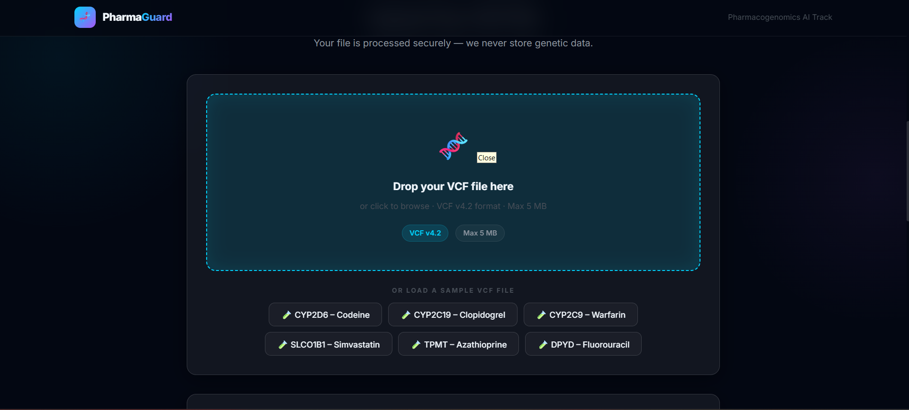
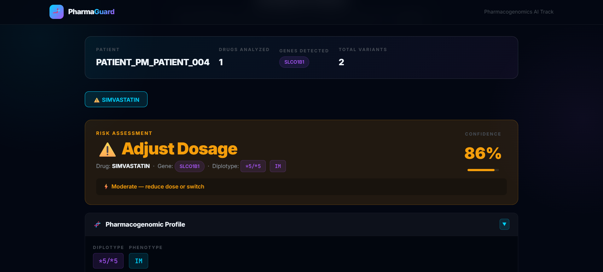
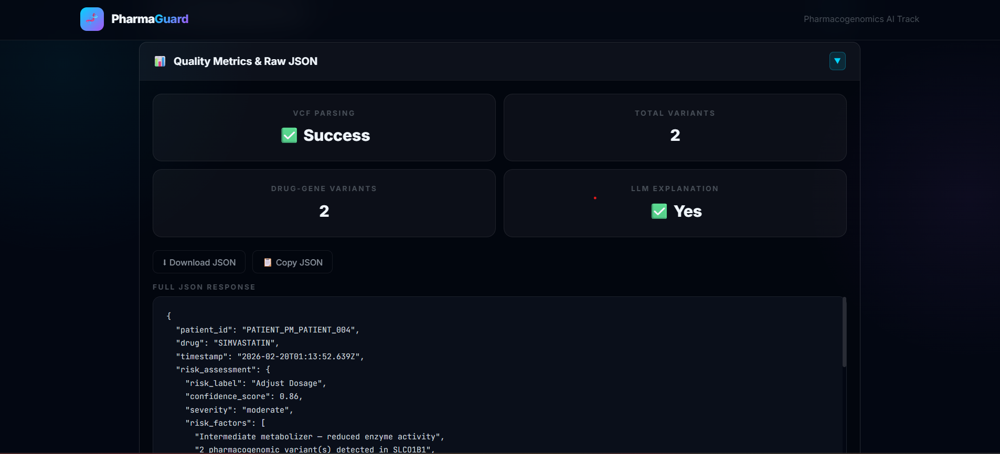

# 🧬 PharmaGuard: Pharmacogenomic Risk Prediction System  
### RIFT 2026 Hackathon — Pharmacogenomics / Explainable AI Track  
**HealthTech • Precision Medicine • Multi-City Hackathon**

---

## 🌍 Live Application

🔗 **Live Deployed App (Vercel):**  
https://pharma-gaurd-neural-ninjas-rift-202-self.vercel.app/





🎥 **LinkedIn Demo Video (Public):**  
https://www.linkedin.com/feed/update/urn:li:activity:7430405237133287424/ 

---

## 🧠 Problem Overview

Adverse Drug Reactions (ADRs) cause over **100,000 preventable deaths annually in the United States**. Many of these cases occur due to genetic variations affecting drug metabolism.

Pharmacogenomic testing enables personalized medicine by analyzing how specific genetic variants influence:

- Drug efficacy  
- Drug toxicity  
- Dosage requirements  

However, genomic data (VCF files) are complex and not easily interpretable without computational tools.

---

## 💡 Our Solution

**PharmaGuard** is an AI-powered web application that:

1. Parses authentic **VCF (Variant Call Format v4.2)** files  
2. Identifies pharmacogenomic variants across six critical genes:  
   - CYP2D6  
   - CYP2C19  
   - CYP2C9  
   - SLCO1B1  
   - TPMT  
   - DPYD  
3. Predicts drug-specific risks:
   - Safe  
   - Adjust Dosage  
   - Toxic  
   - Ineffective  
   - Unknown  
4. Generates structured JSON output matching the exact RIFT schema  
5. Produces clinically actionable recommendations aligned with CPIC guidelines  
6. Uses LLM-powered explanations with biological mechanisms and variant citations  

PharmaGuard bridges genomics, explainable AI, and clinical usability in a single interface.

---

## 🏗 Architecture Overview

### 🔹 Frontend
- HTML5  
- CSS3  
- Vanilla JavaScript  
- Drag-and-drop file upload  
- JSON schema validation  

### 🔹 Core Engine
- VCF Parsing Module  
- Variant–Gene Mapping Engine  
- Drug–Gene Interaction Logic  
- Risk Classification System  
- CPIC-aligned Recommendation Engine  

### 🔹 Explainability Layer
- LLM-powered explanation generation  
- Variant-level biological reasoning  
- Structured clinical summary output  

---

## 🛠 Tech Stack

- HTML  
- CSS  
- JavaScript  
- JSON Schema Validation  
- LLM API Integration  
- Vercel (Deployment)

---

## 📂 Input Specifications

### 1️⃣ VCF File Upload
- Format: `.vcf` (Variant Call Format v4.2)  
- Max file size: 5 MB  
- Supports INFO tags:
  - GENE  
  - STAR  
  - RS  
- Client-side validation before processing  

### 2️⃣ Drug Name Input
Supported drugs:
- CODEINE  
- WARFARIN  
- CLOPIDOGREL  
- SIMVASTATIN  
- AZATHIOPRINE  
- FLUOROURACIL  

Supports:
- Single drug input  
- Multiple drugs (comma-separated)  
- Input validation  

---

## 📊 Output Structure (Schema-Compliant)

PharmaGuard generates structured JSON strictly matching the required schema:

```json
{
  "patient_id": "PATIENT_XXX",
  "drug": "DRUG_NAME",
  "timestamp": "ISO8601_timestamp",
  "risk_assessment": {
    "risk_label": "Safe | Adjust Dosage | Toxic | Ineffective | Unknown",
    "confidence_score": 0.0,
    "severity": "none | low | moderate | high | critical"
  },
  "pharmacogenomic_profile": {
    "primary_gene": "GENE_SYMBOL",
    "diplotype": "*X/*Y",
    "phenotype": "PM | IM | NM | RM | URM | Unknown",
    "detected_variants": [
      {
        "rsid": "rsXXXX"
      }
    ]
  },
  "clinical_recommendation": {},
  "llm_generated_explanation": {
    "summary": "..."
  },
  "quality_metrics": {
    "vcf_parsing_success": true
  }
}
```
---

## 🎨 Web Interface Features

### ✅ File Upload Interface
- Drag-and-drop support  
- File picker option  
- File size validation  
- VCF structure validation  
- Clear error feedback  

### ✅ Risk Visualization
- Color-coded risk labels:
  - 🟢 Green — Safe  
  - 🟡 Yellow — Adjust Dosage  
  - 🔴 Red — Toxic / Ineffective  
- Expandable explanation sections  
- Clinical recommendation display  

### ✅ JSON Utilities
- Copy-to-clipboard functionality  
- Downloadable JSON output  

### ✅ Error Handling
- Invalid VCF detection  
- Missing annotation handling  
- Drug input validation  
- Graceful schema validation errors  

## 🚀 Installation & Local Setup

### 1️⃣ Clone the Repository

```bash
git clone https://github.com/AnuragA1727/PharmaGaurd-NeuralNinjas-RIFT2026.git
cd pharmaguard
```

## 📘 API & Logic Documentation

### 🔬 VCF Parsing
- Extracts gene symbols from INFO fields  
- Maps rsIDs to known pharmacogenomic variants  
- Validates STAR allele annotations  

### 🧠 Risk Prediction Logic
- Maps gene + phenotype → drug-specific risk category  
- Assigns severity levels  
- Generates CPIC-aligned dosage guidance  

### 🤖 LLM Integration
- Structured prompt engineering  
- Variant-level biological explanations  
- Clinical reasoning summary generation  

---

## 🔬 Example Workflow

1. Upload patient VCF file  
2. Enter drug: `CODEINE`  
3. System detects CYP2D6 diplotype  
4. Risk predicted (e.g., Toxic)  
5. Clinical explanation generated with biological mechanism  

---

## 📈 Innovation Highlights

- End-to-end VCF → clinical recommendation pipeline  
- Explainable AI instead of black-box predictions  
- CPIC-aligned dosing framework  
- Structured JSON output for interoperability  
- Designed for real-world healthcare integration  

---

## 🔮 Future Improvements

- Expanded CPIC guideline database integration  
- Support for additional pharmacogenes  
- EHR integration using FHIR standards  
- Multi-patient batch processing  
- Secure authentication system  
- Backend microservices architecture  
- PDF clinical report export  
- Improved probabilistic confidence scoring  
- Cloud-based genomic storage integration  

---

## 👥 Team Breakdown

### 🧠 Himanshi Shakya — Frontend & System Architecture
- UI/UX design  
- UI optimization  

### 🤖 Himanshu Yadav — AI & LLM Integration
- Prompt engineering  
- VCF parsing engine  
- Risk classification logic  
- JSON schema compliance  
- Explanation generation  

### 🧬 Priyanshu Singh — Pharmacogenomics Research
- CPIC mapping  
- Gene-drug interaction logic  
- Variant validation  
- Clinical summary formatting  

### ⚙ Anurag Arora — Testing & Validation
- JSON schema testing  
- Edge case handling  
- Test case validation  
- Deployment  